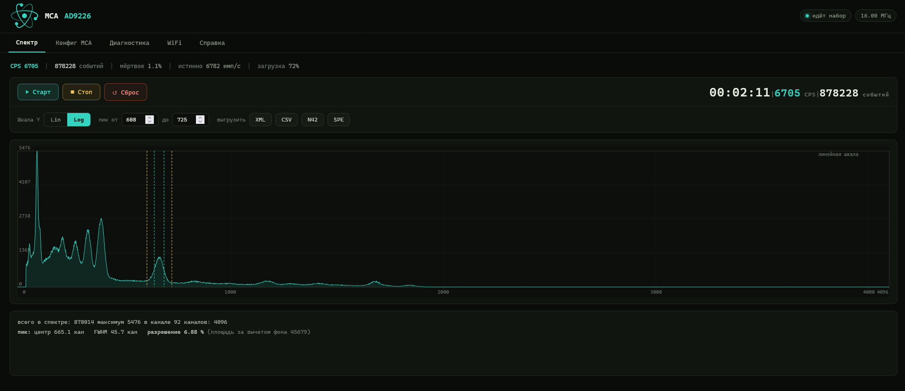
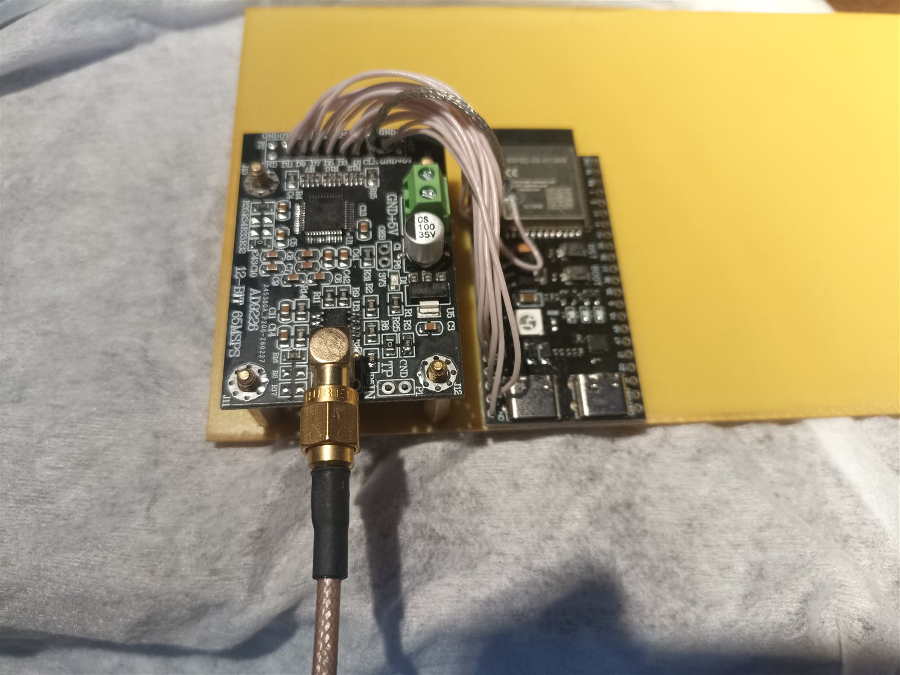
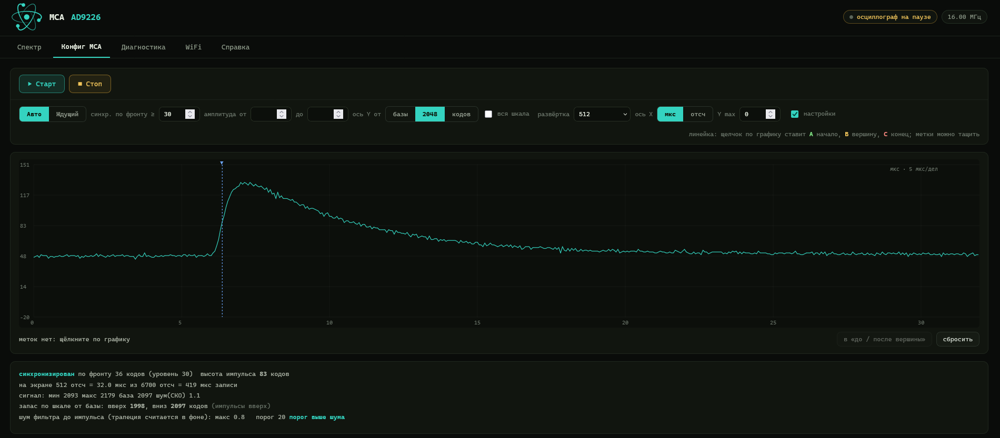
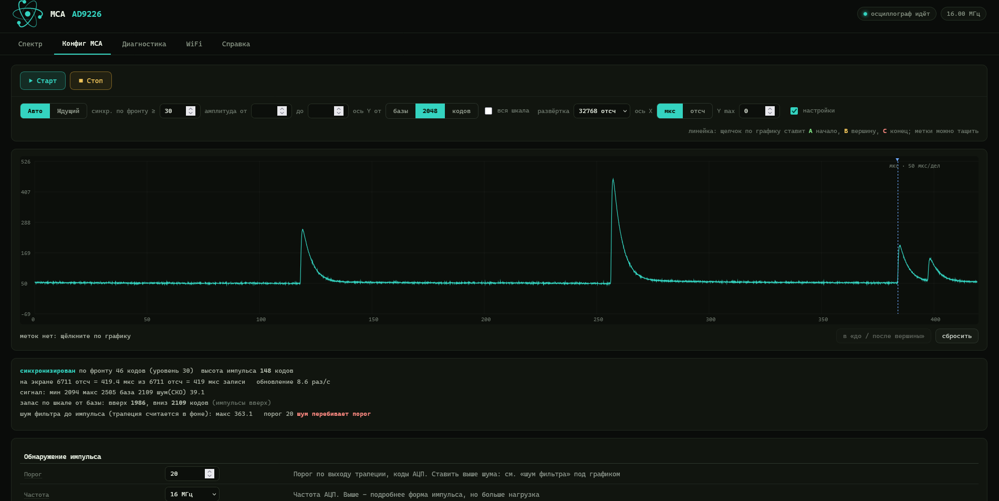
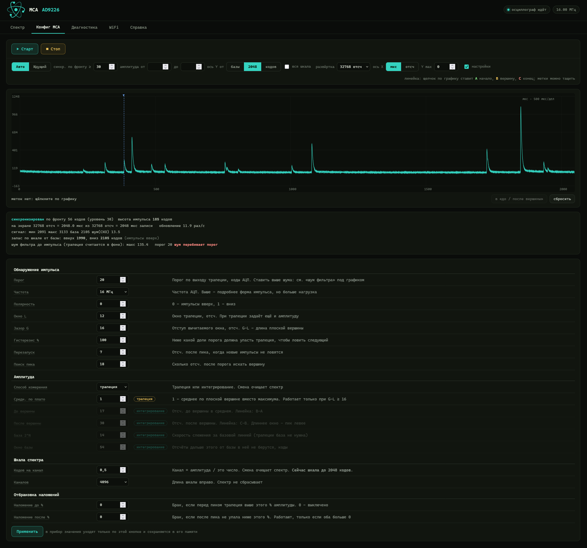

# MCA on ESP32-S3 + AD9226

[🇷🇺 Русский](README.md) · **🇬🇧 English**

A multichannel pulse-height analyzer (gamma spectrometer) built on an
ESP32-S3-N16R8 and a 12-bit AD9226 ADC board. The ADC stream is captured by
hardware (LCD_CAM + GDMA), the second core does the signal processing, and
control and plots are served as a web page over WiFi (or Ethernet).

ESP-IDF 5.4.4.

> The web interface is in English or Russian: the RU / EN switch is in the
> header, next to the ADC frequency. Firmware console messages are in
> Russian; where this document quotes one, a translation is given in brackets.



*Spectrum: 2 min 11 s of acquisition, 6705 cps, dead time 1.1 %, CLK 16 MHz,
4096 channels. Selected peak: centroid at channel 665, FWHM 45.7 channels,
resolution 6.88 %.*



*Prototype: AD9226 board and an ESP32-S3-N16R8 module board, data and CLK
wired with jumper wires.*

## Build and flash

```
idf.py set-target esp32s3
idf.py build
idf.py -p COM3 flash monitor
```

**WiFi.** On first start the device brings up an open access point
`MCA-Setup`. Connect to it and open `http://192.168.4.1/wifi` to enter the
name and password of your network. The device connects to it without
turning the access point off; the address appears in the console:
`STA подключена: http://<ip>/ канал N (МГц)` (STA connected, channel N).
The router channel is printed on purpose — see “CLK interference with
WiFi”.

## Wiring

AD9226 board (connector P2) → ESP32-S3:

| ESP32-S3 | Signal | P2 |
|---|---|---|
| GPIO4  | DATA12/OTR | 17 |
| GPIO5  | **CLK (output)** | 6 |
| GPIO6  | DATA0 | 5 |
| GPIO7  | DATA1 | 8 |
| GPIO8  | DATA2 | 7 |
| GPIO9  | DATA3 | 10 |
| GPIO10 | DATA4 | 9 |
| GPIO11 | DATA5 | 12 |
| GPIO12 | DATA6 | 11 |
| GPIO13 | DATA7 | 14 |
| GPIO14 | DATA8 | 13 |
| GPIO15 | DATA9 | 16 |
| GPIO16 | DATA10 | 15 |
| GPIO17 | DATA11 | 18 |
| GPIO18 | **PCLK (input)** | jumper to GPIO5 |

+5 V to pins 1–2, ground to 3/4/19/20, plus a separate short, thick ground
wire between the boards.

**D0–D11 are consecutive on GPIO6–17.** LCD_CAM itself does not care about
the order, but the data-line check on the diagnostics page reads the port
with a single instruction.

**The GPIO5 → GPIO18 jumper is required:** CLK is output on GPIO5, and the
capture is clocked from GPIO18.

### How to route CLK (important for WiFi)

```
             jumper 1–2 cm
GPIO18 ──────────────┐
                     │
GPIO5  ──────────────●──[ 47 Ω ]──── CLK wire ──────── CLK  (AD9226)
                                     GND wire ──────── GND  (AD9226)
                                     (twisted together)
```

- Connect GPIO18 to GPIO5 **right at the ESP32**, and run a single CLK wire
  to the ADC. Two long wires to one CLK point on the ADC board form a loop —
  a ready-made antenna.
- A 33–68 Ω series resistor, **after** the point where GPIO18 is connected:
  if PCLK is taken after the resistor, the edge gets a step and the capture
  may trigger twice per clock.
- Twist the CLK wire with a ground wire; keep everything short and away
  from the module antenna (the end of the module without the metal shield).

Why this matters — see “CLK interference with WiFi”.

## Ethernet (WIZnet W5500) — optional

The W5500 module is connected over SPI. If it is absent or does not respond,
the device works over WiFi as before.

| W5500 | ESP32-S3 |
|---|---|
| SCLK | GPIO41 |
| MOSI | GPIO40 |
| MISO | GPIO39 |
| SCS (CS) | GPIO42 |
| INT | GPIO21 |
| RST | leave unconnected (modules have a pull-up, reset is done in software) |
| 3.3V / GND | 3V3 / GND |

Pins are changed in `main/mca_config.h` (`PIN_ETH_*`); the module is
disabled there as well: `MCA_ETH_ENABLE 0`. The SPI bus runs at 20 MHz. The
address comes from DHCP and is printed in the console:
`Ethernet подключён: http://<ip>/` (Ethernet connected), and shown on the
“Network” page.

**Turning WiFi off** — “Network” page, “Turn WiFi off” button. Without WiFi the interference from the ADC CLK harmonics goes
away too (see “CLK interference with WiFi”). So that you never lose access
to the device:
- WiFi can be turned off only when Ethernet already has an address — the
  page shows it;
- the setting is saved; if the W5500 is missing at a start with WiFi off,
  WiFi is turned on immediately;
- while WiFi is off, the device watches the Ethernet address: 30 s without
  an address — at start or later (cable unplugged, router rebooted) — WiFi
  turns itself on. The setting is kept, and on the next start the device
  tries Ethernet-only again;
- to turn WiFi back on, use the same page over Ethernet.

Keep the SPI wires, like CLK, short and away from the module antenna: if
WiFi is on at the same time, the 20 MHz bus has harmonics too.

## MCA emulation on the serial port (shproto protocol)

The device can answer on a serial port as an MCA speaking the binary
**shproto** protocol — PC programs that work with such analyzers (for
example [BecqMoni](https://github.com/Am6er/BecqMoni)) see it as a regular
analyzer.

- **Port** — UART0: the “UART”/COM connector of the board (USB-UART
  bridge), not the native USB. Settings `8 N 1`.
- **Enabling** — “MCA config” → settings → “MCA emulation on COM”: “off” or
  a baud rate
  `38400 | 115200 | 460800 | 600000 | 921600`. Takes effect immediately and
  is saved. The whole spectrum fits into one second only at 460800 and
  above.
- **The console is silent** while emulation is on: firmware messages are
  not sent to the port (nor to the native USB). Bootloader messages on reset
  still come out at 115200 — programs skip them. Flashing through this port
  works as usual.
- **Commands:** `-inf`, `-cal` (40 registers, read and write, stored in the
  device memory; by default there is no calibration and the serial number
  is derived from the MAC), `-sta [sec] [-r] [-s]`, `-sto`, `-sho`, `-stt`,
  `-rst`, `-mode 0`, `-spd`, `-frq` (nearest higher frequency from the
  table), `-reboot`. Every executed command is answered with the text
  `-ok`, and `-sta` at 38400 and 115200 with `Warning: silent mode forced
  due to low interface speed-ok`: these are exactly the answers BecqMoni
  waits for when starting an acquisition (without them it reports that it
  cannot read data from the port). Commands are parsed in the middle of a
  spectrum upload as well, so the answer comes in under a second at any
  baud rate. Factory tuning commands (`-ris`, `-fall`, `-U`, `-V`, `-nos`,
  `-pileup`…) are not executed and are answered with `-err not supported`:
  processing parameters are set on the device page.
- **During acquisition**, every second — a status packet (acquisition time,
  load, CPS, rejected pulses — pile-ups and off-scale events), then the
  whole spectrum: 8192 channels in packets of 64. `-sta` starts spectrum
  acquisition on the device itself, `-sto` stops it.
- **Dead time.** Programs compute it as
  `(spectrum sum + rejected) · (RISE + FALL + 1) / F`. After every detected
  pulse the device is blind for the peak search and the re-arm, so in the
  `-inf` answer `RISE` = “Peak search”, and `FALL` is chosen
  so that `RISE + FALL + 1` is the average number of dead-time samples per
  pulse (measured; while there are few pulses — “Re-arm”). The
  program’s live time then matches the device. In BecqMoni the dead time is
  read only by the dead-time button in the device settings: acquire a few
  seconds with a source first, then press it; press it again after
  changing the ADC frequency or processing parameters.
- **Channels — as set in the device “Channels” setting
  (2048/4096/8192).** The protocol and programs always hold 8192 channels:
  BecqMoni keeps the spectrum in an 8192-element array and itself sums
  `8192/N` adjacent channels to get the N channels from its settings.
  Therefore, when N is below 8192, the device stretches each of its
  channels over `8192/N` adjacent ones, splitting the count without
  remainder — and BecqMoni with **the same N in its settings** sums them
  back into exactly the device channels. Set the same number of channels in
  BecqMoni as on the device: on a mismatch the spectrum is stretched or
  compressed. Events above the scale (channels N to 8191) go to “rejected”,
  so that the “total pulses” and the dead time in the program stay correct.

PC check: `python tools/emu_check.py COM3 600000` — sends commands and
parses the answers according to the rules of the reference protocol (CRC,
escaping, `-inf`/`-cal` format, order of status and spectrum) and of
BecqMoni (answers to commands).

## Web interface

- **Language** — English or Russian, RU / EN buttons in the header next to
  the ADC frequency. The choice is remembered in the browser; without a
  choice the browser language is used (Russian for `ru`, otherwise English).
- **Spectrum** — acquisition, lin/log scale, analysis of the
  selected peak (centroid, FWHM, resolution), file export: XML
  (ResultDataFile, opens in BecqMoni), CSV (channel, count), N42
  (ANSI N42.42), SPE (SpectraLine).
- **MCA config** — oscilloscope with edge triggering (auto
  and normal modes, time base 64–32768 samples, amplitude triggering —
  “amplitude from–to”: show only pulses whose height above
  the baseline is within the given range of ADC codes, X axis in µs or in
  samples from the trigger point), a ruler with A/B/C markers (start, peak,
  end of the pulse — copied into the integration parameters) and a table of
  all processing settings, marked with the measurement method each one
  belongs to.
- **Start/Stop apply to the open tab:** on “Spectrum” — spectrum acquisition
  (together with “Reset”, the status line and acquisition
  time/CPS/events; the time runs only while the spectrum is being
  acquired), on “MCA config” — only the oscilloscope: pause holds the last
  frame and does not touch spectrum acquisition. The firmware turns ADC
  capture on by itself when the open tab needs it.
- **Diagnostics** (`/diag`) — sample stream and its real
  rate, per-bit statistics of the data lines, last-second profile
  (including processing busy time and CPU cycles per sample by stage —
  copy, difference, threshold and events — against the budget of
  240 MHz / sample rate), chunk loss log with the device mode, data-line
  check.



*Oscilloscope paused, time base 512 samples (32 µs at 16 MHz): a single
pulse 83 codes high, baseline noise 1.1 codes RMS.*



*About 420 µs: pulses of different heights, on the right — a pile-up of two
consecutive pulses.*



*Time base 32768 samples (2 ms at 16 MHz) and the processing settings table:
parameters of the other measurement method are dimmed.*

## Architecture

**Capture.** LCD_CAM in camera mode + GDMA, a ring of 16 buffers of 2046
samples. The size is almost the limit: the length field of a GDMA
descriptor is 12 bits (up to 4095 bytes). With 8192 bytes the mask gave
zero, the controller got a zero-size buffer and silently delivered no
chunks at all. The queue depth equals the number of buffers: an index in a
deeper queue would point to an already overwritten buffer.

**Cores.** Core 1 — the processing task (`dsp`). Core 0 — WiFi, TCP/IP,
web server and the capture interrupt.

**Processing.** Recursive trapezoidal filter. The window difference is
computed with ESP32-S3 vector instructions (PIE), 8 samples at a time; at
start it is self-checked against the plain code, and if the check fails the
plain code is used. Events are detected on the trapezoid output; the
amplitude is taken from the trapezoid top or by integrating the samples
around the peak minus the baseline. Pile-up rejection, dead time,
hysteresis. The histogram has 8192 channels in PSRAM; 2048/4096/8192 are
shown; “Codes per channel” sets the scale.

**Only what is open is processed:** the spectrum is not computed in
oscilloscope mode.

### ADC frequencies

CLK is generated by LEDC from 80 MHz, so only 80/K is available:

| MHz | K | Duty cycle |
|---|---|---|
| 1, 2, 4, 5, 6.67, 8, 10 | 80, 40, 20, 16, 12, 10, 8 | 50 % |
| 8.89, 11.43 | 9, 7 | not 50 % |
| 13.33 | 6 | 50 % |
| 16 | 5 | 40/60 |
| 20 | 4 | 50 % — oscilloscope only |

Measured at 16 MHz in spectrum mode: the processing task takes ~85 % of
core 1, no chunk losses. The load grows in proportion to the frequency, so
at 20 MHz spectrum processing cannot keep up. Hot-loop estimate
(`tools/hotloop.py`): ~5.4 cycles per sample while waiting for an event
(1.75 — vector difference, 3.6 — search).

The page gets the frequency list from the firmware (`/cfg`, field `fl`),
its own for each CLK generator. The frequency is stored in the device
memory in hertz.

## Findings from debugging

### CLK interference with WiFi

**Symptom.** At 16 MHz the oscilloscope refreshed in waves, `/scope`
responses took up to 1–3 s, and ping to the device jumped up to 350 ms. The
longer the time base, the worse.

**What the experiments showed** (console profile, see below):

| Experiment | Result |
|---|---|
| 16 MHz, capture running | core 1 is 3 % busy, no losses — yet the link breaks |
| 16 MHz, **capture stopped**, core 0 is 2–4 % busy | the link still breaks |
| only CLK changed to 13.33 MHz | within a second `/scope` 10 times/s at 10–16 ms |
| only the router channel 10 → 6 | much better: 9–10 times/s at 45–98 ms |
| 16 MHz, router channel 1 | “everything is bad” |
| 16 MHz, router channel 8 | fine |

So the CPU and the software are not to blame: the CLK signal interferes. A
square wave contains all multiples of its frequency; 154 × 16 MHz =
2464 MHz — inside channel 10 (2457 ± 8.75 MHz). The CLK wires are an
antenna a few centimeters from the module antenna, and the WiFi receiver is
very sensitive: some packets get lost and TCP waits for retransmissions. A
longer time base means more packets per response and a higher chance of
losing at least one.

**What it depends on.** What matters is not the ADC frequency by itself but
**the pair “ADC frequency + router channel”**: whether a strong harmonic
falls into the channel band (centre 2407 + 5·N MHz, ±8.75 MHz). The
strength of harmonic number n of a square wave with duty cycle D is
proportional to |sin(π·n·D)|/n:

- 16 MHz (80/5) has a 40/60 duty cycle, and the harmonics alternate in
  strength: 2416 MHz (channel 1) and 2464 MHz (channel 10) are strong,
  2432 and 2448 MHz (channels 4–9) are about 40 % weaker, 2400 and
  2480 MHz are zero. Exactly what the experiment shows: channels 1 and 10
  are bad, 6 and 8 are fine;
- 13.33 MHz (80/6) is a 50 % square wave, even harmonics almost vanish.
  Only even ones fall into channels 4, 9 and 10 — those are clean. On the
  other channels a strong odd harmonic is in the band, and 13.33 MHz is
  worse there than 16 MHz.

Other ESP32 projects see the same: a 5/10/20 MHz clock on a pin degrades
WiFi, 8 MHz does not ([arduino-esp32 #5834](https://github.com/espressif/arduino-esp32/issues/5834));
a 20 MHz camera clock — 50 lost pings out of 60, at 2 MHz not a single TCP
retransmission ([AI-on-the-edge #3558](https://github.com/jomjol/AI-on-the-edge-device/issues/3558));
for some 20 MHz fixes it, for others 8 MHz does ([ESP32-HUB75 #258](https://github.com/mrcodetastic/ESP32-HUB75-MatrixPanel-DMA/discussions/258)).
The latter is not a contradiction: everyone has different router channels.

**Which pair to choose.** Calculated with the formula above and calibrated
against measurements at 16 MHz: ✓ — clean, ~ — usable (like 16 MHz on
channels 6 and 8), ✗ — the link breaks (like 16 MHz on channels 1 and 10).

| ADC, MHz | 1 | 2 | 3 | 4 | 5 | 6 | 7 | 8 | 9 | 10 | 11 | 12 | 13 |
|---|---|---|---|---|---|---|---|---|---|---|---|---|---|
| 1, 2 | ✓ | ✓ | ✓ | ✓ | ✓ | ✓ | ✓ | ✓ | ✓ | ✓ | ✓ | ✓ | ✓ |
| 4 – 10 | ~ | ~ | ~ | ~ | ~ | ~ | ~ | ~ | ~ | ~ | ~ | ~ | ~ |
| 11.43 | ✗ | ✗ | ~ | ~ | ~ | ~ | ~ | ~ | ~ | ~ | ✗ | ✗ | ✗ |
| 13.33 | ✗ | ✗ | ✗ | ✓ | ✗ | ✗ | ✗ | ✗ | ✓ | ✓ | ✗ | ✗ | ✗ |
| 16 | ✗ | ✗ | ✗ | ~ | ~ | ~ | ~ | ~ | ~ | ✗ | ✗ | ✗ | ✗ |
| 20 (oscilloscope) | ✗ | ✗ | ✗ | ✗ | ✓ | ✓ | ✓ | ✓ | ✗ | ✗ | ✗ | ✗ | ✓ |

The calculation assumes ideal edges; in reality high harmonics are even
weaker, so low frequencies are safer than the table shows. Verified on the
device: 16 MHz on channels 1, 6, 8, 10 and 13.33 MHz on channel 10.

### Change the WiFi channel on your router

This is the fastest and free fix: on the device at 16 MHz, the link that did
not work at all on channel 1 became fine on channel 8.

1. Find out the current router channel: on connecting, the device prints
   `STA подключена: http://<ip>/ канал N (МГц)` to the console.
2. Open the router settings in a browser — that is the gateway address
   (usually `192.168.0.1` or `192.168.1.1`; the device prints it in the
   console as `gw`).
3. Wireless section, 2.4 GHz band → Channel: instead of “Auto” set a
   **fixed** channel from the table for your ADC frequency. For example,
   channel 8 for 16 MHz (4–9 are fine), channel 9 or 10 (or 4) for
   13.33 MHz.
4. Set the channel width to **20 MHz** rather than 40 or “auto”: the wider
   the band, the more harmonics fall into it.
5. Save. The device reconnects by itself, and the console shows the new
   channel. The `MCA-Setup` access point moves to the same channel
   automatically.

Why not “Auto”: the router may switch at any moment to a channel where a
CLK harmonic kills the link, and the device “suddenly” stops responding. If
several channels fit, pick the one with fewer neighbouring networks.
Changing the channel affects all devices on that network — they reconnect
by themselves.

### What else helps (from strongest to weakest)

1. CLK wiring — see “How to route CLK”: a short wire twisted with ground,
   a series resistor at GPIO5. Slowing the edges suppresses exactly the
   high harmonics the most.
2. An ESP32-S3 module with an external antenna connector, the antenna
   10–20 cm away from the ADC board.
3. A shield made of **copper-clad PCB laminate** connected to ground. Cover
   the side of the ESP32 board where the data and CLK wires reach the
   pins — this separates the wire bundle from the module antenna.
   Important:
   - **do not cover the antenna.** It is the end of the module without the
     metal shield. Keep copper at least ~15 mm away from it; the antenna
     end of the module must stick out past the edge of the shield. Metal
     near the antenna detunes it, and the link gets worse, not better;
   - **ground the copper:** connect it to the ESP32 board GND with a short,
     wide conductor, preferably in two or three places. An ungrounded plate
     re-radiates the interference at 2.4 GHz;
   - copper side facing out, or covered with Kapton tape, so the pins are
     not shorted;
   - even better — lay the wires directly on the grounded copper: a wire
     lying on a ground plane has a small current loop and radiates almost
     nothing.

   In the prototype photo above the wire bundle arcs over the module next
   to the antenna — a shield and routing the wires away from the antenna
   should noticeably reduce the interference.
4. A “frequency + channel” pair from the table — works around the
   interference but does not remove it.

WiFi power saving is already disabled on the device (`WIFI_PS_NONE`) —
this is also recommended for such interference. Spread-spectrum clocking
(the clock frequency slowly wanders by a fraction of a percent) is a
standard anti-EMI technique, but LEDC cannot do it; it is only possible
with an external clock generator.

It is not known exactly how the interference reaches the receiver — over
the air or through power and ground. The measures are the same.

### A CLK generator from the camera block — did not work

`adc_clk.c` contains a second generator: the CAM_CLK output of the LCD_CAM
block, integer dividers from 160 and 240 MHz (up to 20 MHz, including 12,
15, 17.14). It is enabled with `MCA_CLK_GEN_CAM 1` in `mca_config.h`. The
calculation promised that at 17.14 MHz (240/14) channel 6 would be clean —
assuming a 50 % square wave. In practice, with capture **stopped**, ping
went 0.3–1.25 s with losses and the interface stopped opening: much worse
than 16 MHz from LEDC. So CAM_CLK is not a clean square wave (the
documentation does not promise the duty cycle of this output). We went back
to LEDC. Before trying again — look at GPIO5 with an oscilloscope.

The generator switch takes into account that resetting LCD_CAM also stops
this clock, so the module clock source and divider are set only by
`adc_clk` (`adc_clk_cam_apply`), and `adc_cap` calls it after the reset.

### TCP send buffer

By default `CONFIG_LWIP_TCP_SND_BUF_DEFAULT` = 5760 bytes (4 segments). A
16–32 KB `/scope` response took 6 “burst — acknowledgement” round trips,
and a lost tail cost a timer retransmission (1.5 s). It is set to 16384 —
the response goes in one or two round trips. This is a limit, not
pre-allocated memory.

### Oscilloscope

- **Window sized to the time base: up to 8192 in internal RAM, longer in
  PSRAM.** The device collects exactly what the page requests: the time
  base plus the trapezoid margin, with one fifth of the screen before the
  trigger (the prehistory used to be always 6144 samples). At 20 MHz with
  the windows in PSRAM chunks were lost — only in the oscilloscope and
  only during `/scope` requests: writing one capture buffer into the
  window took up to 0.9 ms against a 0.1 ms budget. The PSRAM data cache
  is 32 KB, the window up to 64 KB, and the web was reading the snapshot
  from there at the same time. Now two windows of up to 8400 samples
  (2 × 17 KB) live in internal RAM and two full ones in PSRAM for the
  16384 and 32768 time bases; with those, losses are possible at 20 MHz.
  (The window was once moved to internal RAM because of page freezes —
  that time the cause turned out to be CLK harmonics in WiFi.)
- **The snapshot is sent to the network straight from its buffer**,
  without a copy: while the response is being sent no new frames are
  published, and the next window is collected in another buffer.
- **Pre-trigger history without copying.** Up to 6 KB used to be copied
  per chunk, with a budget of 128 µs per chunk at 16 MHz. Now pointers to
  the four previous capture buffers are kept (history up to 6144 samples),
  and the copy is made once on trigger. The edge is searched only when the
  history is complete — otherwise the first frames after capture start
  (it restarts on tab switch and after pause) would jump across the screen.
  Every capture start is marked as a stream gap: the spectrum filter and
  the oscilloscope history are reset. If the queue is almost full, the
  trigger is skipped: otherwise the history would be taken from a buffer
  that DMA is already overwriting.
- **Edge search with step 4 + exact refinement.** Four times cheaper than a
  full scan, same trigger point. A model against a full scan on 4000
  random chunks: 0 differences on real edges; differences only where the
  full scan triggered on a noise spike shorter than 4 samples.
- **Lock-free snapshot.** The web copies the snapshot under a “reading”
  flag; publishing does not swap buffers meanwhile and just skips the
  frame. The web used to hold a mutex during the copy, and the processing
  task took it on every chunk — that caused losses.
- **Amplitude triggering.** Triggering is still on the edge, but after it
  the device measures the pulse height: the maximum over 256 samples after
  the edge minus the mean of 64 samples before it (ADC codes, taking
  polarity into account). Outside the “from–to” range the frame is dropped
  as soon as those 256 samples are in, without waiting for the end of the
  window, and the device waits for the next edge. The height of the shown
  pulse and the number of dropped ones since the previous frame are printed
  under the plot.
- **Frames go over WebSocket (`/ws`), losslessly compressed.** The page
  sends its settings there (time base, level, amplitude, pause), and the
  device pushes a frame only when the snapshot is new and the previous
  frame has gone out, at most 20 times per second. The page used to poll
  `/scope` and in normal mode got the same frame over and over; over
  Ethernet (W5500) that was 3 Mbit/s at the 16384 time base and 4 Mbit/s
  at 32768 — close to the module's SPI limit. Samples are sent as 4-bit
  differences (`main/scope_codec.c`): a difference of −7…7 is one nibble,
  otherwise an escape and the full sample. On the signal model a frame is
  3.4–4 times smaller: 16384 — 33 → 8 KB, 32768 — 66 → 20 KB. The message
  is cut into 4 KB pieces, so compression runs on the fly without a large
  buffer. At start the device self-tests the codec; if that fails, frames
  go uncompressed (the page understands both). Under the plot you can see
  “stream … kbit/s” and which way it goes.
- **The page also draws at most 20 times per second**, at any time base.
  Large frames arrive over TCP in bursts; when each was drawn at once, the
  browser could not keep up with 32768 points, frames piled up, and the
  refresh rate first raced and then dropped. Now a frame that arrives
  early waits, and the next one replaces it — the freshest is drawn.
  “Refresh … /s” is the number of frames drawn per second.
- If the WebSocket does not open, the page polls `/scope` as before: the
  response is binary (7 × int32 + uint16 samples), the next request right
  after drawing, at most every 50 ms. The device prepares snapshots at
  most every 25 ms.

### Other

- Pinning the TCP/IP task to core 0 made things worse: the web waited
  longer for its core. Left unpinned, but the processing task now has
  priority 19, above TCP/IP (18): when TCP/IP moved to core 1 it
  preempted the processing (which had 10), and at 20 MHz the capture
  queue holds only 1.6 ms.
- Processing statistics and parameters are under a spinlock, not a
  mutex. “Apply” and “Reset” held the mutex while clearing the histogram
  in PSRAM and printing to the console, and the processing task waited
  milliseconds — guaranteed losses. Now the processing task itself clears
  the spectrum and restarts the filter, the histogram in pieces of 1024
  channels per chunk; during these ~0.8 ms of the stream the spectrum is
  not acquired and the acquisition time does not run. “Reset” now also
  zeroes the above-scale event counter, which used to accumulate.
- The spectrum is read without locking; events are written to the histogram
  without a mutex, and the accumulated counts are flushed once per chunk.
- GPIO matrix constants: 0x38 — constant one, 0x30 — constant zero
  (confirmed by the espScope project code). Unused CAM data lines are tied
  to zero so they do not pick up noise.
- Rates “per second” (sample rate, CPS, chunks) are computed over the
  actually elapsed time: the one-second tick comes from the lowest-priority
  main loop, and under core 0 load (for example, spectrum upload over COM)
  it stretched to 1.1–1.2 s, overstating the rate by 10–20 %.

## Console diagnostics

By default the profile is not printed to the console — only the line
`потеряно чанков: N, при последней потере шёл /…` (chunks lost: N, the
request in progress at the last loss was /…), and only in the second when
losses happened. The “Diagnostics” page always shows the
profile. To enable printing: `#define MCA_PROF_LOG 1` in
`main/mca_config.h`. Then every second:

```
prof: q=4/16 work=0.90 wait=0.23 busy 75% lost=0 | sp 1x23 sc 10x14 st 1x1 | heap 125k/87k rssi -24 load 71% cps 2242
prof: cpu0 5% cpu1 86% | dsp(1) 85.4% httpd(0) 2.2% wifi(0) 0.9% main(0) 0.9% tiT(*) 0.5%
```

| Field | Meaning |
|---|---|
| `q` | peak chunk queue depth; 16/16 — losses will follow |
| `work` / `wait` | longest chunk processing / wait for a chunk, ms |
| `busy` | share of time the processing task is busy, in any mode |
| `lost` | chunks lost per second |
| `sp`, `sc`, `st` | `/spectrum`, `/scope`, `/stat` requests per second × the longest, ms |
| `heap` | free internal memory / its all-time minimum |
| `rssi` | WiFi signal level |
| `load` | load inside spectrum processing |
| `cpu0`, `cpu1` | core load from FreeRTOS accounting (interrupt time counts toward the interrupted task) |
| `task(core)` | busiest tasks; `*` — not pinned to a core |

For each loss there is a line `ПОТЕРЯ +n q=… шёл /ep Xms work=…` (LOSS):
which request was being served at that moment and for how long.

## Bring-up on new hardware

1. Frequency 1–2 MHz, “MCA config” tab, “Auto” mode,
   Start. Feed something known to the input. Expect a sensible trace. If
   the data is all zeros — check the GPIO5→GPIO18 jumper and the R32–R35
   jumpers on the AD9226 board. If there are no chunks while PCLK is alive,
   the camera interface control-signal mode does not fit: the `s_mode`
   fields in `main/adc_cap.c`. On this board the working mode is all
   polarities non-inverted, frame sync tied to constant zero; it was found
   by trying all 48 variants (variant 16), after which the search was
   removed from the firmware.
2. Signal from the PMT: a flat baseline between pulses, headroom on the
   ADC scale.
3. Raise the frequency step by step, checking the oscilloscope and `lost`
   in the console at each step. Watch the ping to the device: if it grows,
   it is CLK interference, not load.
4. Spectrum: threshold above the trapezoid noise (the “filter
   noise” line under the oscilloscope), L and G from the pulse shape,
   “Codes per channel” so the peaks fit the scale.

## Tools (`tools/`)

- `test_dsp.py` — 9 levels of processing checks on a model, including the
  vector version against the plain one and the oscilloscope frame
  compression against the page decoder (in node). `python tools/test_dsp.py`.
- `dspmodel.py`, `scopemodel.py`, `scopecodec.py` — models of the
  processing, the oscilloscope and its frame compression.
- `hotloop.py` — hot-loop cycle estimate from the disassembly.
- `mkpage.py` — builds `build/page_test.html` with the device page and stub
  responses; open with `python -m http.server 8777 --directory build`.
- `emu_check.py` — checks the MCA emulation on the serial port from a PC
  (`python tools/emu_check.py COM3 600000`; `--selftest` checks the codec
  only).
- `check_i18n.py` — checks that every label of the device pages has an
  English pair (`python tools/check_i18n.py`).
